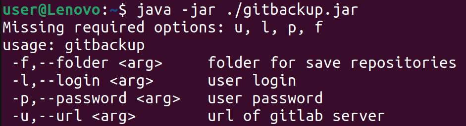

Info:
=============

Gitbackup is designed to help a user generate batch backups files of all gitlab repositories.

General requirements:
=============
A Java version 8 or above is required to run the util.

Getting started:
=============
To get started with Gitbackup you can download a release file or build an executable jar file.

<em>You can use Gradle to build a project.</em> 
 
<pre> gradle build</pre>

<em>Or either use Docker<em>

<pre>
docker run --rm -u gradle -v "$PWD":/home/gradle/project -w /home/gradle/project gradle gradle build --warning-mode all
</pre>

We encourage the use of Docker if you don't have Gradle yet.

The build output directory is:
<pre> 
./build/lisb/gitbackup.jar"
</pre>
Help:
=============
The following table includes the set of arguments required to run the util.

|Symbol|Description|
|------|------------|
|-f,--folder|repositories folder|
|-l,--login|user login|
|-p,--password|user password|
|-u,--url|url of a gitlab server|

Run:
=============
Open a console to run the util. Choose the folder to save to or create a new folder using the mkdir command. The arguments should be as follows:
<pre>
sudo java -jar ./gitbackup.jar -f ./folder -l user -p password -u https://gitlab.com
</pre>

> Note: run the program without arguments to get the Help prompt.

All of your GitLab projects will be stored in the target directory.
